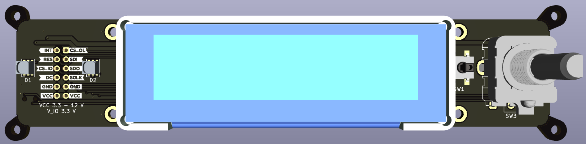

# ui_board_1u
A versatile user interface PCB, specifically designed for integration into the front-panel of a 1U height chassis.

__Featuring__

  * Rotary encoder
  * 2x RGB LEDs, brought to the front with light-pipes for mounting flexibility
  * 1x Tactile push button
  * 2.8" diagonal, 256 x 64 pixel OLED display with 16 shades (SSD1322)
  * All connected to a single 12 pin PMOD port

